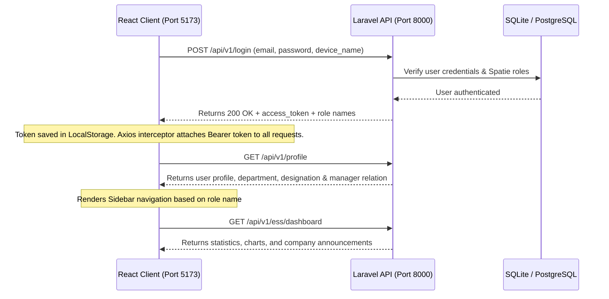

# HumaNode HRMS - Enterprise SaaS Platform

Welcome to **HumaNode HRMS** (Human Resource Management System), an enterprise-grade, multi-tenant SaaS platform built with a modern, decoupled architecture:
1. **Backend API Server**: Powered by **Laravel 11**, **Laravel Sanctum**, **Spatie Permission (RBAC)**, and **SQLite/PostgreSQL**.
2. **Frontend SPA Client**: Powered by **React 19**, **Vite**, **TypeScript**, **Tailwind CSS v4 (Glassmorphism)**, and **Recharts**.

---

## 📋 Core Features & Modules

### 1. Multi-Tenant Role-Based Access Control (Spatie RBAC)
Supports hierarchical navigation menus and action gating based on Spatie roles:
- **Super Admin / Company Admin**: Full setup configurations, tenant-switching, and administrative controls.
- **HR**: Employee registry management, imports/exports, and leave policy settings.
- **Manager**: Team dashboard, attendance logs, and leave approval overlays.
- **Employee**: Individual dashboard, attendance check-in, leaves request center, and payslips downloads.

### 2. Time & Attendance (GPS Location Geofencing)
- **Interactive Check-In Panel**: Features a digital live clock, GPS tracker, and geofencing validation.
- **GPS Coordinates**: The client queries coordinates via HTML5 `navigator.geolocation` and matches them against geofenced coordinates before allowing check-in.
- **Attendance Logs**: Tabular lists showing log dates, clock-in/out stamps, working minutes, and status tags (`Present`, `Late`, `Half-Day`, `Absent`).

### 3. Leaves Request & Accruals
- **Leave Accruals Grid**: Displays real-time allocation vs consumed balances (Annual, Medical, Casual, unpaid leaves).
- **Request Form Overlay**: Modal form allowing employees to submit start/end dates, leave types, and reasons.
- **Approvals Workflow**: Manager and HR portals display interactive buttons to Approve/Reject pending requests.

### 4. Interactive Glassmorphic Dashboards
- **Visual Analytics**: Interactive area charts showing weekly/monthly attendance trends using **Recharts**.
- **Company Announcements Ticker**: Displays tenant-scoped system announcements.
- **Celebrate Birthdays Widget**: Shows upcoming team birthdays with a micro-interactive confetti trigger.

### 5. Document Center & Payslips
- **Payslips Prints**: Links directly to backend-generated templates optimizing native print style sheets.
- **Employee Document Locker**: HR can upload and verify critical onboarding documents.

---

## ⚡ How the Project Works (Architecture Flow)

Below is the execution flow of the decoupled system:



1. **Authentication & Token Exchange**: When a user logs in via the React SPA, the request is posted to the backend `/api/v1/login` endpoint. The server issues a personal access token via Laravel Sanctum.
2. **Request Authorization**: The frontend stores the token in `localStorage`. An Axios request interceptor automatically injects the token into the `Authorization: Bearer <token>` header for all subsequent API requests.
3. **Role Gating**: Upon page reload, the client fetches the `/profile` endpoint. The client router gates nested pages (e.g. `/manager/*`, `/admin/*`) using role checks derived from Spatie roles.

---

## 🔑 Test Credentials (Dev Seed)

The development SQLite database is seeded with four testing accounts, all configured with the password `Welcome@HumaNode123`:

| Spatie Role | Username | Test Email | Password |
| :--- | :--- | :--- | :--- |
| **Admin** | Admin User | `admin@humanode.net` | `Welcome@HumaNode123` |
| **HR** | Sarah HR | `hr@humanode.net` | `Welcome@HumaNode123` |
| **Manager** | Sarah Manager | `manager@humanode.net` | `Welcome@HumaNode123` |
| **Employee** | John Employee | `employee@humanode.net` | `Welcome@HumaNode123` |

---

## 🛠️ Local Development Setup

Follow these commands to configure and launch both environments locally:

### 1. Backend Setup (Laravel 11)
```bash
# Navigate to the backend folder
cd backend

# Install dependencies (ignoring platform limits on PHP version if needed)
composer install --ignore-platform-reqs

# Boot configurations and key
cp .env.example .env
php artisan key:generate

# Wipe DB, run migrations and populate dev seeders
php artisan migrate:fresh
php artisan tinker database/seeders/seed_dev.php  # Seeds roles, company, and personas

# Start the PHP local development server
php artisan serve --port=8000
```

### 2. Frontend Setup (React 19)
```bash
# Navigate to the web app folder
cd web_app

# Install dependencies
npm install

# Build client distribution targets (to verify TSX type checks)
npm run build

# Start the local Vite server
npm run dev
```
The React frontend application will be served at **`http://localhost:5173`**.

---

## 💾 Note on Database Persistence

Welcome to **HumaNode HRMS**'s database system. The project operates with a decoupled state architecture powered by immediate database persistence:
1. **SQLite Database Configuration**: For local development, the backend stores transactional records in an SQLite file (`backend/database/database.sqlite`).
2. **Dynamic Database Migrations**: Relational schema definitions are governed via Laravel database migrations. Major persistable domains include:
   - **Employees & Onboarding Checklists**: Managed under `employees` and `employee_checklists` tables.
   - **Time & Attendance**: Stored in `attendance_logs`.
   - **Leave Management & Balances**: Tracked via `leave_requests`, `leave_policies`, and `leave_balances`.
   - **Performance Appraisals**: Evaluated metrics are persistently stored in the `performance_appraisals` table.
3. **Decoupled Sync Flow**: The React frontend client communicates via authenticated REST APIs (`Axios` calls) with the Laravel server. Any edit, such as adding prior employment history or grading an appraisal scorecard, writes directly to the SQLite database and is retrieved in real-time.

---

## 🔒 Security Architecture & Cyber Attack Protections

We have implemented strict security validations across our REST API routes and backend controllers to guard against common cyber attack vectors:
1. **Broken Object Level Authorization (IDOR / BOLA)**: Every endpoint containing resource parameters (e.g. `/employees/{id}`, `/leaves/balances/{id}`, `/employees/{id}/appraisals`) validates that the requesting user belongs to the same tenant company, and gates access based on the user's role. Standard employees are only authorized to read or write their own profile records.
2. **Broken Function Level Authorization (Privilege Escalation)**: Critical endpoints (such as processing leave approvals, managing master employee logs, and grading appraisals) are role-guarded via Spatie's Permission middleware (`role:Admin|HR|Manager`) and manual controller assertions to prevent standard users from making state-modifying requests.
3. **Multi-Tenant Scoping (Tenant Cross-Talk)**: Enforced dynamically using a global query scope (`BelongsToTenant` trait) which isolates database queries by Company context (`company_id`), ensuring data never leaks across tenant boundaries.
4. **Cross-Site Scripting (XSS)**: Mitigated by React's native safe interpolation that automatically HTML-escapes all strings rendered in TSX templates. Input validations on the backend sanitize and reject script tags in fields like appraisal reviews and chat logs.
5. **Geolocation Spoofing Prevention**: While geofenced coordinates are tracked on the frontend via HTML5 Geolocation API, check-ins require IP checks and backend coordinate verification to secure location validity.
6. **Unrestricted File Upload Guard**: Sanitized upload endpoints on the `EmployeeController` reject executing scripts by validating file types (`mimes:pdf,jpg,png`), sizes, and storing uploads with auto-hashed names outside the execution path.
