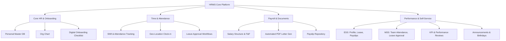

# HumaNode HRMS - Project Blueprint & Architecture (Laravel Backend)

Welcome to the **HumaNode HRMS** (Human Resource Management System) project workspace. This document serves as the master blueprint for building a complete, enterprise-grade HRMS spanning a **Laravel API Backend**, a **React Web App** (for Admins, HRs, and desktop users), and a **Flutter App** (for Employee/Manager Self-Service on mobile).

Since you are planning to build this project using **vibe coding**, this documentation is structured specifically to be **directly consumable by an AI coding assistant**. It outlines Laravel API endpoints, database structures, component hierarchies, state management strategies, and step-by-step prompting guides.

---

## 📖 Table of Contents
1. [Core Features & Modules](#-core-features--modules) (extracted from notebook notes)
2. [Shared Architecture & Tech Stack](#-shared-architecture--tech-stack)
3. [Monorepo Directory Structure](#-monorepo-directory-structure)
4. [Step-by-Step Vibe Coding Roadmap](#-step-by-step-vibe-coding-roadmap)
5. [Next Steps](#-next-steps)

---

## 📋 Core Features & Modules

Below is the mapping of your handwritten requirements into structured software modules:



### 1. Employment Information & Onboarding
*   **Personal Master Database:** Stores personal details, contact information, emergency contacts, and employment history.
*   **Department & Designation Mapping:** Dynamic department assignment and role definitions.
*   **Organization Chart:** Visual representation of reporting structures.
*   **Digital Onboarding Management:** Digital joining forms, document collection/verification, asset allocation checklists, automatic employee ID generation, and induction scheduling.

### 2. Attendance & Time Management
*   **Shift Management & Timesheets:** Define flexible or rotating shifts and submit weekly/monthly timesheets.
*   **Geo-Location Attendance:** Field employees can clock in/out with coordinates verified against geofenced work zones.
*   **Late Coming Reports:** Automate notifications and logs for attendance discrepancies.

### 3. Leave Management
*   **Leave Policy Configuration:** Configure leave types (casual, medical, annual, comp-off) and accrual rules.
*   **Approval Workflows:** Multi-level leave application and approvals.
*   **Leave Encashment & Reports:** Annual calculations for leave payouts and department-wide leave summaries.

### 4. Payroll & Documents
*   **Payroll Processing:** Salary structure management, revision workflows, and Full & Final (F&F) settlements.
*   **Document Generation Engine:** PDF generator for official letters (Offer Letter, Appointment Letter, Salary Revision, Promotion, Warnings, and Experience & Relieving Letters).

### 5. Self-Service Portal (ESS & MSS)
*   **Employee Self-Service (ESS):** Mobile-first UI for profile updates, viewing attendance logs, applying for leaves, downloading payslips, and reading company announcements.
*   **Manager Self-Service (MSS):** UI for monitoring team attendance, reviewing leave requests, and generating team reports.
*   **Performance Management:** KPI tracking, self/manager appraisals, and periodic reviews.
*   **Birthdays & Announcements:** Dashboard widgets for team celebrations and critical company updates.

---

## ⚡ Shared Architecture & Tech Stack

To ensure a robust, highly extensible backend, we select a decoupled **Laravel API** backend. This allows both the React Web App and the Flutter Mobile App to communicate via secure REST APIs.

*   **Backend & API Engine:**
    *   **Laravel 11 (PHP 8.2+)**
    *   **Database:** PostgreSQL or MySQL (managed via Laravel Migrations and Eloquent ORM).
    *   **Authentication:** **Laravel Sanctum**. Provides lightweight, token-based authentication perfect for single-page React apps (via cookies/tokens) and Flutter mobile apps (via bearer tokens).
    *   **PDF Engine:** Laravel PDF/DomPDF wrapper for generating official employee letters.
*   **Web Frontend:**
    *   **React (Vite) + TypeScript + Tailwind CSS**. Communicates with the Laravel API via Axios.
*   **Mobile App:**
    *   **Flutter (Dart) + Riverpod** (State Management). Uses Flutter HTTP/Dio clients to communicate with Laravel endpoints.

---

## 📁 Monorepo Directory Structure

Create this folder structure in this repository so your AI coding assistant understands the layouts of all three applications:

```text
HRMS/
├── README.md                          # This file
├── backend/                           # Laravel 11 API Backend
│   ├── app/
│   │   ├── Http/Controllers/          # API Controllers (Auth, Attendance, Leave)
│   │   └── Models/                    # Eloquent Models (Employee, Leave, Shift)
│   ├── database/
│   │   ├── migrations/                # Database tables & relations
│   │   └── seeders/                   # Seed data for employees, depts, policies
│   ├── routes/
│   │   └── api.php                    # REST API Endpoint declarations
│   └── composer.json
├── web_app/                           # React Web Application
│   ├── src/
│   │   ├── components/                # Reusable UI (Buttons, Modals, OrgChart)
│   │   ├── features/                  # Module-specific pages (Onboarding, Payroll)
│   │   ├── hooks/                     # Custom React hooks (useAuth, useAttendance)
│   │   └── lib/                       # Axios client & apiEndpoints config
│   └── package.json
└── mobile_app/                        # Flutter Mobile Application
    ├── lib/
    │   ├── core/                      # Constants, themes, API clients (Dio)
    │   ├── models/                    # Data models (Employee, Leave, Shift)
    │   ├── providers/                 # Riverpod states & auth providers
    │   ├── views/                     # Mobile screens (ESS, MSS, Clock-In)
    │   └── main.dart
    └── pubspec.yaml
```

---

## 🚀 Step-by-Step Vibe Coding Roadmap

To get the best results from vibe coding, go phase-by-phase. Below are the exact phases and **prompts to copy-paste to your AI assistant**.

### Phase 1: Laravel Backend & DB Setup
Create the API backend structure and run migrations.
*   **Prompt to AI:** 
    > "I am building an HRMS project with a Laravel 11 backend. Let's start by scaffolding the backend API.
    > 1. Set up Laravel in a `/backend` folder.
    > 2. Set up database migrations and Eloquent Models for: `departments`, `designations`, `employees` (linked to users with roles [Employee, Manager, HR, Admin]), `attendance_logs`, `leave_requests`, `documents`, and `salary_structures`.
    > 3. Install and configure Laravel Sanctum for API token authentication.
    > 4. Generate seed files for testing roles and departments."

### Phase 2: Web App - Admin Dashboard & Axios Integration
Get the dashboard working in React, querying the Laravel API.
*   **Prompt to AI:**
    > "Scaffold the React web app in `web_app/` using Vite, React, Tailwind CSS, and TypeScript. Set up an Axios HTTP client that routes to `http://localhost:8000/api`. Configure it to handle Bearer Token auth. Build a responsive, glassmorphic dashboard layout with a sidebar containing: Dashboard, Employee Master, Onboarding, Attendance, and Leave. Connect the login page to the Laravel Sanctum API endpoint."

### Phase 3: Mobile App - Authentication & Geo-Location Attendance
Bring the Flutter mobile app to life using Laravel API.
*   **Prompt to AI:**
    > "Let's scaffold the Flutter mobile app in `mobile_app/`. Set up Riverpod for state management. Integrate a RestClient/Dio setup pointing to our Laravel API at `http://10.0.2.2:8000/api` (for Android emulator) or `http://localhost:8000/api` (for iOS simulator). Design the 'Attendance Clock-In' card: it must fetch the user's GPS coordinates using the `geolocator` package, verify if they are within a geofenced range of the office coordinates, and submit a POST request to `/api/attendance/clock-in`."

### Phase 4: Document Generation & Payroll in Laravel
Generate PDFs using Laravel's file systems.
*   **Prompt to AI:**
    > "Let's implement the PDF document generation system using Laravel. Create a controller in Laravel that uses a PDF rendering package (like barryvdh/laravel-dompdf). Set up endpoints to generate and download signed official letters (Offer Letter, Warning, Relieving). In the React Web App, build the UI form templates to trigger this endpoint, and in the Flutter App, let employees download their payslips."

---

## 🛠️ Next Steps

To make this repository fully prepared, I am modifying three additional detailed guides in the `architecture/` folder:
1.  **[database_schema.md](file:///Users/abhishekanair/MyGithubProfile/HRMS/architecture/database_schema.md)**: Laravel Migrations, Eloquent Relations, and Model definitions.
2.  **[web_app_guide.md](file:///Users/abhishekanair/MyGithubProfile/HRMS/architecture/web_app_guide.md)**: React components, styling systems, and Axios API connector integration.
3.  **[flutter_app_guide.md](file:///Users/abhishekanair/MyGithubProfile/HRMS/architecture/flutter_app_guide.md)**: Mobile layouts, Riverpod states, and Dio API call controllers.
4.  **[vibe_coding_workflow.md](file:///Users/abhishekanair/MyGithubProfile/HRMS/architecture/vibe_coding_workflow.md)**: Running Laravel dev servers, Composer, and route testing.

*Let's update these files next.*
