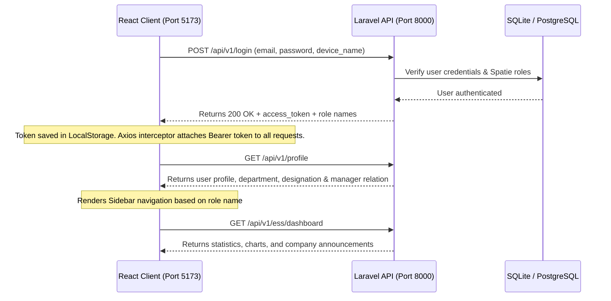

# HumaNode HRMS - Enterprise SaaS Platform

Welcome to **HumaNode HRMS** (Human Resource Management System), an enterprise-grade, multi-tenant SaaS platform built with a modern, decoupled architecture:
1. **Backend API Server**: Powered by **Laravel 11**, **Laravel Sanctum**, **Spatie Permission (RBAC)**, and **SQLite/PostgreSQL**.
2. **Frontend SPA Client**: Powered by **React 19**, **Vite**, **TypeScript**, **Tailwind CSS v4 (Glassmorphism)**, and **Recharts**.

---

## 📋 Core Features & Modules

### 1. Multi-Tenant Role-Based Access Control (Spatie RBAC)
Supports hierarchical navigation menus and action gating based on Spatie roles:
- **Super Admin / Company Admin**: Full setup configurations, tenant-switching, and administrative controls.
- **HR**: Employee registry management, imports/exports, and leave policy settings.
- **Manager**: Team dashboard, attendance logs, and leave approval overlays.
- **Employee**: Individual dashboard, attendance check-in, leaves request center, and payslips downloads.

### 2. Time & Attendance (GPS Location Geofencing)
- **Interactive Check-In Panel**: Features a digital live clock, GPS tracker, and geofencing validation.
- **GPS Coordinates**: The client queries coordinates via HTML5 `navigator.geolocation` and matches them against geofenced coordinates before allowing check-in.
- **Attendance Logs**: Tabular lists showing log dates, clock-in/out stamps, working minutes, and status tags (`Present`, `Late`, `Half-Day`, `Absent`).

### 3. Leaves Request & Accruals
- **Leave Accruals Grid**: Displays real-time allocation vs consumed balances (Annual, Medical, Casual, unpaid leaves).
- **Request Form Overlay**: Modal form allowing employees to submit start/end dates, leave types, and reasons.
- **Approvals Workflow**: Manager and HR portals display interactive buttons to Approve/Reject pending requests.

### 4. Interactive Glassmorphic Dashboards
- **Visual Analytics**: Interactive area charts showing weekly/monthly attendance trends using **Recharts**.
- **Company Announcements Ticker**: Displays tenant-scoped system announcements.
- **Celebrate Birthdays Widget**: Shows upcoming team birthdays with a micro-interactive confetti trigger.

### 5. Document Center & Payslips
- **Payslips Prints**: Links directly to backend-generated templates optimizing native print style sheets.
- **Employee Document Locker**: HR can upload and verify critical onboarding documents.

---

## ⚡ How the Project Works (Architecture Flow)

Below is the execution flow of the decoupled system:



1. **Authentication & Token Exchange**: When a user logs in via the React SPA, the request is posted to the backend `/api/v1/login` endpoint. The server issues a personal access token via Laravel Sanctum.
2. **Request Authorization**: The frontend stores the token in `localStorage`. An Axios request interceptor automatically injects the token into the `Authorization: Bearer <token>` header for all subsequent API requests.
3. **Role Gating**: Upon page reload, the client fetches the `/profile` endpoint. The client router gates nested pages (e.g. `/manager/*`, `/admin/*`) using role checks derived from Spatie roles.

---

## 🔑 Test Credentials (Dev Seed)

The development SQLite database is seeded with four testing accounts, all configured with the password `Welcome@HumaNode123`:

| Spatie Role | Username | Test Email | Password |
| :--- | :--- | :--- | :--- |
| **Admin** | Admin User | `admin@humanode.net` | `Welcome@HumaNode123` |
| **HR** | Sarah HR | `hr@humanode.net` | `Welcome@HumaNode123` |
| **Manager** | Sarah Manager | `manager@humanode.net` | `Welcome@HumaNode123` |
| **Employee** | John Employee | `employee@humanode.net` | `Welcome@HumaNode123` |

---

## 🛠️ Local Development Setup

Follow these commands to configure and launch both environments locally:

### 1. Backend Setup (Laravel 11)
```bash
# Navigate to the backend folder
cd backend

# Install dependencies (ignoring platform limits on PHP version if needed)
composer install --ignore-platform-reqs

# Boot configurations and key
cp .env.example .env
php artisan key:generate

# Wipe DB, run migrations and populate dev seeders
php artisan migrate:fresh
php artisan tinker database/seeders/seed_dev.php  # Seeds roles, company, and personas

# Start the PHP local development server
php artisan serve --port=8000
```

### 2. Frontend Setup (React 19)
```bash
# Navigate to the web app folder
cd web_app

# Install dependencies
npm install

# Build client distribution targets (to verify TSX type checks)
npm run build

# Start the local Vite server
npm run dev
```
The React frontend application will be served at **`http://localhost:5173`**.
