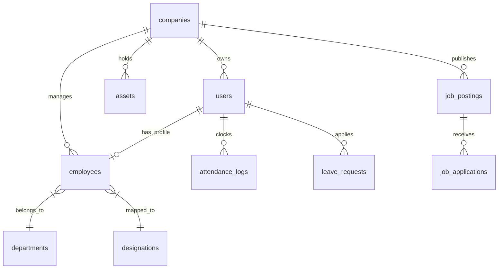

# Database & Eloquent Schema Blueprint (Laravel)

This document outlines the database structure and Eloquent ORM relations for the HumaNode SaaS HRMS. It is configured to support multi-tenancy, recruitment, assets, and payroll modules.

---

## 🛠️ Database Entity Diagram

Our Laravel database structure uses Eloquent relationships. The `Company` (tenant) model anchors all data, with every tenant-owned resource containing a `company_id` key for logical security isolation.



---

## 🗄️ Laravel Migrations Schema

These table definitions can be passed to your AI developer to generate Laravel migration files (`database/migrations/`).

### 1. Multi-Tenant Anchor

```php
// Companies Migration (The tenant entity)
Schema::create('companies', function (Blueprint $table) {
    $table->id();
    $table->string('name');
    $table->string('domain')->unique()->nullable();
    $table->string('logo_url')->nullable();
    
    // SaaS Billing Attributes
    $table->string('stripe_id')->nullable()->index();
    $table->string('pm_type')->nullable();
    $table->string('pm_last_four', 4)->nullable();
    $table->timestamp('trial_ends_at')->nullable();
    $table->enum('plan_type', ['Free', 'Pro', 'Enterprise'])->default('Free');
    
    $table->timestamps();
});
```

### 2. Authentication, Users & Roles (Multi-Tenant)

```php
// Users Migration
Schema::create('users', function (Blueprint $table) {
    $table->id();
    $table->foreignId('company_id')->constrained('companies')->onDelete('cascade'); // Multi-tenant link
    $table->string('name');
    $table->string('email')->unique();
    $table->timestamp('email_verified_at')->nullable();
    $table->string('password');
    $table->enum('role', ['Employee', 'Manager', 'HR', 'Admin'])->default('Employee');
    $table->boolean('is_active')->default(true);
    $table->rememberToken();
    $table->timestamps();
});
```

### 3. Department & Designation Mappings

```php
// Departments Migration
Schema::create('departments', function (Blueprint $table) {
    $table->id();
    $table->foreignId('company_id')->constrained('companies')->onDelete('cascade');
    $table->string('name');
    $table->text('description')->nullable();
    $table->foreignId('manager_id')->nullable()->constrained('users')->onDelete('set null');
    $table->timestamps();
    $table->unique(['company_id', 'name']); // Unique per tenant
});

// Designations Migration
Schema::create('designations', function (Blueprint $table) {
    $table->id();
    $table->foreignId('company_id')->constrained('companies')->onDelete('cascade');
    $table->foreignId('department_id')->constrained()->onDelete('cascade');
    $table->string('title');
    $table->string('salary_grade', 10);
    $table->timestamps();
    $table->unique(['company_id', 'department_id', 'title']); // Unique per tenant/dept
});
```

### 4. Employee Master & Onboarding

```php
// Employees Migration
Schema::create('employees', function (Blueprint $table) {
    $table->id();
    $table->foreignId('company_id')->constrained('companies')->onDelete('cascade');
    $table->foreignId('user_id')->constrained()->onDelete('cascade');
    $table->string('employee_id', 20); // e.g. EMP-2026-0001
    $table->string('first_name');
    $table->string('last_name');
    $table->string('phone')->nullable();
    $table->enum('status', ['Active', 'Probation', 'Suspended', 'Terminated'])->default('Probation');
    $table->foreignId('department_id')->nullable()->constrained()->onDelete('set null');
    $table->foreignId('designation_id')->nullable()->constrained()->onDelete('set null');
    $table->foreignId('manager_id')->nullable()->constrained('users')->onDelete('set null');
    $table->date('joining_date');
    $table->json('emergency_contact')->nullable(); // {name, relationship, phone}
    $table->json('employment_history')->nullable(); // array of objects
    $table->timestamps();
    $table->unique(['company_id', 'employee_id']); // Unique employee ID per tenant
});

// Onboarding Checklists Migration
Schema::create('onboarding_checklists', function (Blueprint $table) {
    $table->id();
    $table->foreignId('company_id')->constrained('companies')->onDelete('cascade');
    $table->foreignId('employee_id')->constrained('employees')->onDelete('cascade');
    $table->boolean('joining_form_completed')->default(false);
    $table->boolean('documents_verified')->default(false);
    $table->json('asset_allocation')->nullable();
    $table->timestamp('induction_scheduled_at')->nullable();
    $table->json('department_checklist')->nullable();
    $table->enum('status', ['Pending', 'In-Progress', 'Completed'])->default('Pending');
    $table->timestamps();
});
```

### 5. Attendance & Time Tracking

```php
// Shifts Migration
Schema::create('shifts', function (Blueprint $table) {
    $table->id();
    $table->foreignId('company_id')->constrained('companies')->onDelete('cascade');
    $table->string('name');
    $table->time('start_time');
    $table->time('end_time');
    $table->integer('grace_period_minutes')->default(15);
    $table->timestamps();
});

// Attendance Logs Migration
Schema::create('attendance_logs', function (Blueprint $table) {
    $table->id();
    $table->foreignId('company_id')->constrained('companies')->onDelete('cascade');
    $table->foreignId('user_id')->constrained()->onDelete('cascade');
    $table->timestamp('clock_in');
    $table->timestamp('clock_out')->nullable();
    $table->decimal('location_lat', 9, 6)->nullable();
    $table->decimal('location_lng', 9, 6)->nullable();
    $table->boolean('is_field_checkin')->default(false);
    $table->enum('status', ['Present', 'Late', 'Absent', 'Half-Day'])->default('Present');
    $table->decimal('timesheet_hours', 4, 2)->nullable();
    $table->date('log_date');
    $table->timestamps();
});
```

### 6. Leave Management

```php
// Leave Policies Migration
Schema::create('leave_policies', function (Blueprint $table) {
    $table->id();
    $table->foreignId('company_id')->constrained('companies')->onDelete('cascade');
    $table->string('name');
    $table->integer('total_days');
    $table->integer('carry_over_max')->default(0);
    $table->string('accrual_rate')->nullable();
    $table->timestamps();
    $table->unique(['company_id', 'name']);
});

// Leave Balances Migration
Schema::create('leave_balances', function (Blueprint $table) {
    $table->foreignId('company_id')->constrained('companies')->onDelete('cascade');
    $table->foreignId('employee_id')->constrained('employees')->onDelete('cascade');
    $table->foreignId('leave_policy_id')->constrained()->onDelete('cascade');
    $table->decimal('balance_days', 4, 1);
    $table->decimal('used_days', 4, 1)->default(0.0);
    $table->primary(['employee_id', 'leave_policy_id']);
});

// Leave Requests Migration
Schema::create('leave_requests', function (Blueprint $table) {
    $table->id();
    $table->foreignId('company_id')->constrained('companies')->onDelete('cascade');
    $table->foreignId('user_id')->constrained()->onDelete('cascade');
    $table->foreignId('leave_policy_id')->nullable()->constrained()->onDelete('set null');
    $table->date('start_date');
    $table->date('end_date');
    $table->boolean('half_day')->default(false);
    $table->text('reason');
    $table->enum('status', ['Pending', 'Approved', 'Rejected'])->default('Pending');
    $table->foreignId('approved_by')->nullable()->constrained('users')->onDelete('set null');
    $table->text('comments')->nullable();
    $table->timestamps();
});
```

### 7. Recruitment & ATS (Phase 11)

```php
// Job Postings Migration
Schema::create('job_postings', function (Blueprint $table) {
    $table->id();
    $table->foreignId('company_id')->constrained('companies')->onDelete('cascade');
    $table->string('title');
    $table->text('description');
    $table->string('department_name')->nullable();
    $table->string('location')->nullable();
    $table->enum('status', ['Draft', 'Active', 'Closed'])->default('Draft');
    $table->timestamps();
});

// Job Applications Migration
Schema::create('job_applications', function (Blueprint $table) {
    $table->id();
    $table->foreignId('company_id')->constrained('companies')->onDelete('cascade');
    $table->foreignId('job_posting_id')->constrained()->onDelete('cascade');
    $table->string('applicant_name');
    $table->string('applicant_email');
    $table->string('resume_path'); // S3 Link to CV PDF
    
    // AI CV Parsing columns (loaded by Phase 17)
    $table->json('parsed_skills')->nullable();
    $table->json('parsed_experience')->nullable();
    
    $table->enum('status', ['Applied', 'Interviewing', 'Offered', 'Rejected'])->default('Applied');
    $table->timestamps();
});
```

### 8. Asset Management (Phase 12)

```php
// Assets Migration
Schema::create('assets', function (Blueprint $table) {
    $table->id();
    $table->foreignId('company_id')->constrained('companies')->onDelete('cascade');
    $table->string('name');
    $table->string('serial_number')->nullable();
    $table->string('type'); // Laptop, Phone, Token
    $table->enum('status', ['Available', 'Assigned', 'Under-Maintenance', 'Disposed'])->default('Available');
    $table->timestamps();
    $table->unique(['company_id', 'serial_number']);
});

// Asset Allocations Migration
Schema::create('asset_allocations', function (Blueprint $table) {
    $table->id();
    $table->foreignId('company_id')->constrained('companies')->onDelete('cascade');
    $table->foreignId('asset_id')->constrained()->onDelete('cascade');
    $table->foreignId('employee_id')->constrained('employees')->onDelete('cascade');
    $table->timestamp('assigned_at');
    $table->timestamp('returned_at')->nullable();
    $table->timestamps();
});
```

---

## 🔗 Model Relationships (Eloquent)

Below are the primary Eloquent connections to document in your Laravel models.

### `Company` Model (`app/Models/Company.php`)
```php
class Company extends Model {
    use Billable; // For Laravel Cashier integrations

    public function users() {
        return $this->hasMany(User::class);
    }

    public function employees() {
        return $this->hasMany(Employee::class);
    }

    public function assets() {
        return $this->hasMany(Asset::class);
    }
}
```

### `User` Model (`app/Models/User.php`)
```php
class User extends Authenticatable {
    use HasApiTokens, HasFactory, Notifiable;

    // Global Tenant Scope automatically injected
    protected static function booted() {
        static::addGlobalScope(new TenantScope);
    }

    public function company() {
        return $this->belongsTo(Company::class);
    }

    public function employee() {
        return $this->hasOne(Employee::class);
    }
}
```
