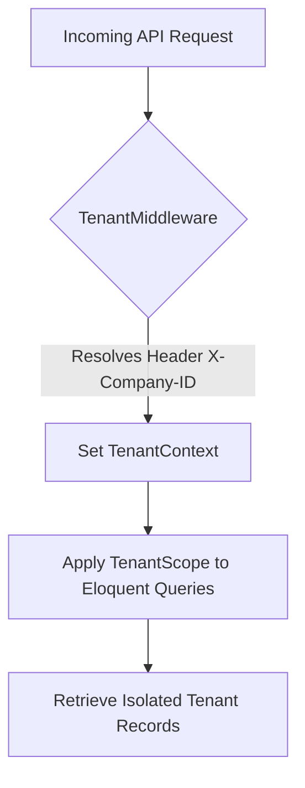
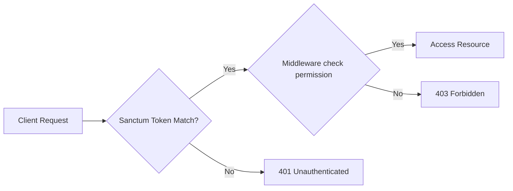
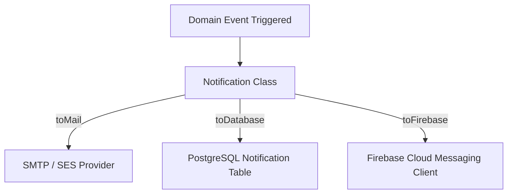

# HumaNode HRMS - Phase 0 Foundation Architecture

This document outlines the enterprise-grade foundation architecture for **HumaNode HRMS**, a multi-tenant SaaS Human Resource Management System built on Laravel 11, PostgreSQL, Sanctum, Redis, and Spatie Laravel Permission.

---

## 🛠️ Step 1 — Laravel Project Creation Commands

To scaffold the Laravel 11 application and install all required enterprise dependencies, execute the following commands in sequence:

```bash
# Initialize Laravel 11 Project inside the backend folder
composer create-project laravel/laravel:^11.0 backend

# Navigate to the backend directory
cd backend

# Install Core Security & Sanctum Auth
composer require laravel/sanctum

# Install Spatie Authorization & Activity Logging
composer require spatie/laravel-permission
composer require spatie/laravel-activitylog

# Install Developer tools for debugging and monitoring (Dev only)
composer require barryvdh/laravel-debugbar --dev
composer require laravel/telescope --dev
composer require nunomaduro/collision --dev

# Install Utilities: Redis Driver, Excel processing, and Image optimization
composer require predis/predis
composer require maatwebsite/excel
composer require intervention/image

# Publish Configuration Files
php artisan sanctum:stateful
php artisan vendor:publish --provider="Spatie\Permission\PermissionServiceProvider"
php artisan vendor:publish --provider="Spatie\Activitylog\ActivitylogServiceProvider"
php artisan telescope:install
```

### Configuration Adjustments

#### 1. PostgreSQL & Redis Database Setup (`.env`)
Update the `.env` file to support PostgreSQL and the Redis driver for session, cache, and queue management:

```env
DB_CONNECTION=pgsql
DB_HOST=127.0.0.1
DB_PORT=5432
DB_DATABASE=humanode_hrms
DB_USERNAME=postgres
DB_PASSWORD=secret_postgres_pass

CACHE_STORE=redis
QUEUE_CONNECTION=redis
SESSION_DRIVER=redis

REDIS_CLIENT=predis
REDIS_HOST=127.0.0.1
REDIS_PASSWORD=null
REDIS_PORT=6379
```

#### 2. Laravel Sanctum Configuration (`config/sanctum.php`)
Configure Sanctum's token expiration, prefix, and guards to authenticate mobile clients and React web clients cleanly:

```php
'expiration' => 525600, // 1 year token expiration for mobile SSO (or set null for permanent)
'token_prefix' => 'hmn_',
'guard' => ['web', 'api'],
```

---

## 📁 Step 2 — Enterprise Folder Structure

HumaNode HRMS utilizes a **Clean Architecture / DDD-Lite** approach. This isolates the database layer, separates business rules from delivery mechanisms, and ensures future extensibility.

```text
app/
├── Http/
│   ├── Controllers/
│   │   ├── Api/
│   │   │   ├── V1/          # Version 1 REST Controllers
│   │   │   └── V2/          # Version 2 REST Controllers (Future-proof)
│   │   └── Web/             # Laravel Blade Admin & Billing Portal Controllers
│   ├── Middleware/          # Custom middleware (Tenant, Role checks)
│   └── Requests/            # Form request validation classes
├── Models/                  # Eloquent database entities
├── Repositories/            # Data Access Layer
│   ├── Contracts/           # Interfaces defining query capabilities
│   └── Eloquent/            # PostgreSQL-specific implementations
├── Services/                # Service Layer (Enterprise Business Rules)
├── Actions/                 # Single-responsibility command actions
├── DTOs/                    # Data Transfer Objects
├── Traits/                  # Reusable language blocks (e.g. ApiResponseTrait)
├── Helpers/                 # Mathematical and formatting functions
├── Enums/                   # Backed PHP enums (Roles, Statuses, Leave Types)
├── Events/                  # Domain Event Dispatchers
├── Listeners/               # Event Observers
├── Notifications/           # Multi-channel notification delivery configurations
├── Jobs/                    # Queueable background task executors
├── Policies/                # Spatie/Sanctum Authorization Policies
├── Exceptions/              # Custom application errors
└── Rules/                   # Custom business validation rules (e.g. GeofenceRule)
```

### Directory Responsibilities

| Directory | Core Purpose |
| :--- | :--- |
| `Controllers/Api` | Resolves HTTP requests, calls Services, returns standard JSON payloads. |
| `Models` | Defines DB mappings, Eloquent relationships, and entity properties. |
| `Repositories` | Encapsulates data fetching and storage logic. No business validation. |
| `Services` | Houses transaction handling, integrations, calculations, and business rules. |
| `Actions` | Standalone, single-action commands (e.g., `GeneratePayslipPdfAction`). |
| `DTOs` | Implements strongly typed inputs across controller-to-service-to-repository pipelines. |
| `Traits` | Shares logic (e.g., `BelongsToTenant` for automatic company filtering). |
| `Enums` | Centralizes status codes and constant parameters (e.g., `EmployeeStatus::probation`). |
| `Jobs` | Manages background operations like automated PDF rendering and email schedules. |
| `Exceptions` | Isolates custom domain errors with pre-formatted HTTP response status codes. |

---

## 🗄️ Step 3 — Database Design Standards

To ensure database consistency, referential integrity, and efficient querying across thousands of rows:

1. **Table Names:** Plural, snake_case (e.g., `attendance_logs`, `leave_requests`).
2. **Primary Key:** Every table must use **UUID** (`id`) as the primary key. This prevents ID scraping and facilitates synchronization with mobile clients.
3. **Foreign Keys:** Named `singular_table_name_id` matching UUID format (e.g., `company_id`).
4. **Soft Deletes:** All master tables and transactional logs must include `deleted_at` timestamps.
5. **Audit Fields:** Every table must track mutations with:
   - `created_at` (timestamp)
   - `updated_at` (timestamp)
   - `deleted_at` (timestamp, nullable)
   - `created_by` (UUID, foreign key pointing to `users.id`, nullable)
   - `updated_by` (UUID, foreign key pointing to `users.id`, nullable)
6. **Tenant Context:** Tables mapped to tenants must contain:
   - `company_id` (UUID, non-nullable, indexed)
   - `branch_id` (UUID, nullable, indexed - permits cross-branch corporate management)

### PostgreSQL Schema Template (SaaS Standards)
```php
Schema::create('employees', function (Blueprint $table) {
    $table->uuid('id')->primary();
    $table->uuid('company_id')->index();
    $table->uuid('branch_id')->nullable()->index();
    $table->uuid('user_id')->unique();
    
    $table->string('employee_id')->index(); // ERP identifier
    $table->string('first_name');
    $table->string('last_name');
    
    // Audit Logging & Soft Deletes
    $table->uuid('created_by')->nullable();
    $table->uuid('updated_by')->nullable();
    $table->timestamps();
    $table->softDeletes();

    // Constraints & Indices
    $table->foreign('company_id')->references('id')->on('companies')->cascadeOnDelete();
    $table->foreign('branch_id')->references('id')->on('branches')->nullOnDelete();
    $table->foreign('user_id')->references('id')->on('users')->cascadeOnDelete();
    $table->unique(['company_id', 'employee_id']); // Contextual isolation
});
```

---

## 🏢 Step 4 — Multi-Tenant Architecture

HumaNode HRMS uses a **Single-Database Logical Isolation** SaaS design. Database rows are filtered automatically using a tenant identifier.



### 1. Multi-Tenant Core Schema
```php
// Companies Table
Schema::create('companies', function (Blueprint $table) {
    $table->uuid('id')->primary();
    $table->string('name');
    $table->string('subdomain')->unique()->nullable();
    $table->string('domain')->unique()->nullable();
    $table->timestamps();
    $table->softDeletes();
});

// Branches Table
Schema::create('branches', function (Blueprint $table) {
    $table->uuid('id')->primary();
    $table->uuid('company_id')->index();
    $table->string('name');
    $table->string('code')->nullable();
    $table->timestamps();
    $table->softDeletes();
    
    $table->foreign('company_id')->references('id')->on('companies')->cascadeOnDelete();
});
```

### 2. Tenant Context Resolver (`app/Services/TenantContext.php`)
```php
namespace App\Services;

use App\Models\Company;
use App\Models\Branch;

class TenantContext
{
    protected ?Company $company = null;
    protected ?Branch $branch = null;

    public function setCompany(Company $company): void
    {
        $this->company = $company;
    }

    public function getCompanyId(): ?string
    {
        return $this->company?->id;
    }

    public function setBranch(Branch $branch): void
    {
        $this->branch = $branch;
    }

    public function getBranchId(): ?string
    {
        return $this->branch?->id;
    }
}
```

### 3. Tenant Global Scope & Trait (`app/Traits/BelongsToTenant.php`)
This trait enforces the tenant condition on database transactions automatically.

```php
namespace App\Traits;

use App\Models\Scopes\TenantScope;
use Illuminate\Database\Eloquent\Builder;

trait BelongsToTenant
{
    public static function bootBelongsToTenant(): void
    {
        static::addGlobalScope(new TenantScope());

        static::creating(function ($model) {
            if (empty($model->company_id) && app()->has(TenantContext::class)) {
                $model->company_id = app(TenantContext::class)->getCompanyId();
            }
            if (empty($model->branch_id) && app()->has(TenantContext::class)) {
                $model->branch_id = app(TenantContext::class)->getBranchId();
            }
        });
    }
}
```

Tenant scope definition (`app/Models/Scopes/TenantScope.php`):
```php
namespace App\Models\Scopes;

use App\Services\TenantContext;
use Illuminate\Database\Eloquent\Builder;
use Illuminate\Database\Eloquent\Model;
use Illuminate\Database\Eloquent\Scope;

class TenantScope implements Scope
{
    public function apply(Builder $builder, Model $model): void
    {
        if (app()->has(TenantContext::class)) {
            $companyId = app(TenantContext::class)->getCompanyId();
            if ($companyId) {
                $builder->where($model->getTable() . '.company_id', $companyId);
            }
        }
    }
}
```

### 4. Tenant Resolution Middleware (`app/Http/Middleware/TenantMiddleware.php`)
```php
namespace App\Http\Middleware;

use Closure;
use App\Models\Company;
use App\Services\TenantContext;
use App\Exceptions\TenantException;
use Illuminate\Http\Request;

class TenantMiddleware
{
    public function handle(Request $request, Closure $next)
    {
        $companyId = $request->header('X-Company-ID') ?? $request->route('company_id');

        if (!$companyId && $request->user()) {
            $companyId = $request->user()->company_id;
        }

        if (!$companyId) {
            throw new TenantException("Missing multi-tenant context boundary header: X-Company-ID", 400);
        }

        $company = Company::find($companyId);
        if (!$company) {
            throw new TenantException("Tenant Context not registered or deactivated", 404);
        }

        app(TenantContext::class)->setCompany($company);

        return $next($request);
    }
}
```

---

## 🏛️ Step 5 — Repository Pattern

The repository pattern abstracts access to data stores, separating SQL configurations from application code.

### 1. Contract (`app/Repositories/Contracts/EmployeeRepositoryInterface.php`)
```php
namespace App\Repositories\Contracts;

use App\Models\Employee;
use Illuminate\Pagination\LengthAwarePaginator;

interface EmployeeRepositoryInterface
{
    public function getActivePaginated(array $filters, int $perPage = 15): LengthAwarePaginator;
    public function findById(string $id): ?Employee;
    public function create(array $data): Employee;
    public function update(string $id, array $data): bool;
    public function delete(string $id): bool;
}
```

### 2. Implementation (`app/Repositories/Eloquent/EmployeeRepository.php`)
```php
namespace App\Repositories\Eloquent;

use App\Models\Employee;
use App\Repositories\Contracts\EmployeeRepositoryInterface;
use Illuminate\Pagination\LengthAwarePaginator;

class EmployeeRepository implements EmployeeRepositoryInterface
{
    public function getActivePaginated(array $filters, int $perPage = 15): LengthAwarePaginator
    {
        return Employee::query()
            ->when($filters['department_id'] ?? null, fn($q, $dept) => $q->where('department_id', $dept))
            ->when($filters['search'] ?? null, fn($q, $search) => $q->where('first_name', 'like', "%{$search}%"))
            ->paginate($perPage);
    }

    public function findById(string $id): ?Employee
    {
        return Employee::find($id);
    }

    public function create(array $data): Employee
    {
        return Employee::create($data);
    }

    public function update(string $id, array $data): bool
    {
        $employee = $this->findById($id);
        return $employee ? $employee->update($data) : false;
    }

    public function delete(string $id): bool
    {
        $employee = $this->findById($id);
        return $employee ? $employee->delete() : false;
    }
}
```

### 3. Service integration (`app/Services/EmployeeService.php`)
```php
namespace App\Services;

use App\Repositories\Contracts\EmployeeRepositoryInterface;
use App\DTOs\EmployeeDto;
use App\Models\Employee;
use Illuminate\Support\Facades\DB;

class EmployeeService
{
    public function __construct(
        protected EmployeeRepositoryInterface $employeeRepository
    ) {}

    public function onboard(EmployeeDto $dto): Employee
    {
        return DB::transaction(function () use ($dto) {
            $employee = $this->employeeRepository->create($dto->toArray());
            
            // Dispatch domain event (triggers notification queues, onboarding schedules)
            event(new \App\Events\EmployeeOnboarded($employee));

            return $employee;
        });
    }
}
```

### 4. Controller Layer (`app/Http/Controllers/Api/V1/EmployeeController.php`)
```php
namespace App\Http\Controllers\Api\V1;

use App\Http\Controllers\Controller;
use App\Services\EmployeeService;
use App\DTOs\EmployeeDto;
use Illuminate\Http\Request;
use App\Traits\ApiResponseTrait;

class EmployeeController extends Controller
{
    use ApiResponseTrait;

    public function __construct(protected EmployeeService $employeeService) {}

    public function store(Request $request)
    {
        $validated = $request->validate([
            'first_name' => 'required|string|max:100',
            'last_name' => 'required|string|max:100',
            'employee_id' => 'required|string',
            'user_id' => 'required|uuid',
            'joining_date' => 'required|date'
        ]);

        $dto = EmployeeDto::fromRequest($validated);
        $employee = $this->employeeService->onboard($dto);

        return $this->successResponse($employee, 'Employee onboarded successfully', 201);
    }
}
```

---

## 🛠️ Step 6 — Service Layer Design

Services encapsulate business workflow rules. Controllers delegate requests directly to services, keeping endpoints light.

### 1. `AttendanceService.php` (Geofence verification & shift checking)
```php
namespace App\Services;

use App\Models\AttendanceLog;
use App\Exceptions\BusinessException;
use Carbon\Carbon;

class AttendanceService
{
    public function clockIn(string $userId, float $lat, float $lng, string $ip): AttendanceLog
    {
        // 1. Geofence Check: Latitude/Longitude matching (Office lat: 25.2048, Lng: 55.2708)
        $distance = $this->calculateDistance($lat, $lng, 25.2048, 55.2708);
        $maxAllowedMeters = 100.0;

        if ($distance > $maxAllowedMeters) {
            throw new BusinessException("Clock-in rejected: Location is outside the allowable office perimeter", 422);
        }

        // 2. Fetch Active Shift configurations
        $shift = $this->resolveActiveShift($userId);
        $now = Carbon::now();
        $status = 'Present';

        if ($now->toTimeString() > $shift->start_time) {
            $lateMinutes = $now->diffInMinutes(Carbon::parse($shift->start_time));
            if ($lateMinutes > $shift->grace_period_minutes) {
                $status = 'Late';
            }
        }

        return AttendanceLog::create([
            'user_id' => $userId,
            'clock_in' => $now,
            'location_lat' => $lat,
            'location_lng' => $lng,
            'status' => $status,
            'log_date' => $now->toDateString(),
            'ip_address' => $ip
        ]);
    }

    protected function calculateDistance($lat1, $lon1, $lat2, $lon2): float
    {
        $earthRadius = 6371000; // Meters
        $dLat = deg2rad($lat2 - $lat1);
        $dLon = deg2rad($lon2 - $lon1);
        $a = sin($dLat/2) * sin($dLat/2) + cos(deg2rad($lat1)) * cos(deg2rad($lat2)) * sin($dLon/2) * sin($dLon/2);
        return $earthRadius * 2 * atan2(sqrt($a), sqrt(1-$a));
    }
}
```

### 2. `LeaveService.php` (Transaction isolation & policy execution)
```php
namespace App\Services;

use App\Models\LeaveRequest;
use App\Models\LeaveBalance;
use App\Exceptions\BusinessException;
use Illuminate\Support\Facades\DB;

class LeaveService
{
    public function applyForLeave(string $employeeId, string $policyId, string $start, string $end): LeaveRequest
    {
        return DB::transaction(function () use ($employeeId, $policyId, $start, $end) {
            $days = Carbon::parse($start)->diffInDays(Carbon::parse($end)) + 1;
            
            $balance = LeaveBalance::where('employee_id', $employeeId)
                ->where('leave_policy_id', $policyId)
                ->lockForUpdate() // Isolate balance calculations
                ->first();

            if (!$balance || ($balance->balance_days - $balance->used_days) < $days) {
                throw new BusinessException("Insufficient leave balance days for this transaction", 400);
            }

            // Record request
            $request = LeaveRequest::create([
                'employee_id' => $employeeId,
                'leave_policy_id' => $policyId,
                'start_date' => $start,
                'end_date' => $end,
                'status' => 'Pending'
            ]);

            return $request;
        });
    }
}
```

---

## 📡 Step 7 — API Versioning

API endpoints are versioned to prevent client crashes during updates.

```text
routes/
├── api_v1.php    # Clean routing for V1 endpoints
└── api_v2.php    # Routing for V2 implementations
```

### 1. Routes Registration (`bootstrap/app.php` in Laravel 11)
```php
return Application::configure(basePath: dirname(__DIR__))
    ->withRouting(
        web: __DIR__.'/../routes/web.php',
        api: __DIR__.'/../routes/api.php', // Base API routing
        commands: __DIR__.'/../routes/console.php',
        health: '/up',
        then: function () {
            Route::middleware('api')
                ->prefix('api/v1')
                ->group(base_path('routes/api_v1.php'));

            Route::middleware('api')
                ->prefix('api/v2')
                ->group(base_path('routes/api_v2.php'));
        }
    );
```

### 2. Version Migration Strategy
When endpoints undergo breaking changes:
- Maintain V1 controller methods intact to prevent breaking mobile client apps.
- Implement data transformers (API Resource classes) to format database outputs dynamically:
```php
// app/Http/Resources/V1/EmployeeResource.php
public function toArray($request) {
    return [
        'full_name' => $this->first_name . ' ' . $this->last_name,
        'contact' => $this->phone,
    ];
}

// app/Http/Resources/V2/EmployeeResource.php (Split first/last name, deprecates contact field)
public function toArray($request) {
    return [
        'firstName' => $this->first_name,
        'lastName' => $this->last_name,
        'phoneNo' => $this->phone,
    ];
}
```

---

## 🔐 Step 8 — Authentication & Authorization Foundation

User security uses **Laravel Sanctum** token credentials, verified against **Spatie Laravel Permission** roles.



### 1. Seed Roles & Security Permissions (`database/seeders/RolesAndPermissionsSeeder.php`)
```php
namespace Database\Seeders;

use Illuminate\Database\Seeder;
use Spatie\Permission\Models\Role;
use Spatie\Permission\Models\Permission;

class RolesAndPermissionsSeeder extends Seeder
{
    public function run(): void
    {
        // Reset cached roles and permissions
        app()[\Spatie\Permission\PermissionRegistrar::class]->forgetCachedPermissions();

        // 1. Define Master Permissions
        $permissions = [
            'view_employees', 'create_employees', 'edit_employees', 'delete_employees',
            'approve_leaves', 'apply_leaves',
            'run_payroll', 'view_payslips',
            'configure_system'
        ];

        foreach ($permissions as $p) {
            Permission::create(['name' => $p, 'guard_name' => 'api']);
        }

        // 2. Define Roles and Map Permissions
        Role::create(['name' => 'Super Admin', 'guard_name' => 'api']); // Bypasses authorization gates
        
        $companyAdmin = Role::create(['name' => 'Company Admin', 'guard_name' => 'api']);
        $companyAdmin->givePermissionTo(Permission::all());

        $hr = Role::create(['name' => 'HR', 'guard_name' => 'api']);
        $hr->givePermissionTo(['view_employees', 'create_employees', 'edit_employees', 'approve_leaves', 'view_payslips']);

        $manager = Role::create(['name' => 'Manager', 'guard_name' => 'api']);
        $manager->givePermissionTo(['view_employees', 'approve_leaves', 'apply_leaves', 'view_payslips']);

        $employee = Role::create(['name' => 'Employee', 'guard_name' => 'api']);
        $employee->givePermissionTo(['apply_leaves', 'view_payslips']);
    }
}
```

### 2. Sanctum API Auth Logic (`app/Http/Controllers/Api/V1/AuthController.php`)
```php
namespace App\Http\Controllers\Api\V1;

use App\Http\Controllers\Controller;
use Illuminate\Http\Request;
use App\Models\User;
use Illuminate\Support\Facades\Hash;
use App\Traits\ApiResponseTrait;

class AuthController extends Controller
{
    use ApiResponseTrait;

    public function login(Request $request)
    {
        $request->validate([
            'email' => 'required|email',
            'password' => 'required',
            'device_name' => 'required'
        ]);

        $user = User::where('email', $request->email)->first();

        if (!$user || !Hash::check($request->password, $user->password)) {
            return $this->errorResponse('Invalid credentials provided', 401);
        }

        // Generate context-aware token containing Spatie roles
        $token = $user->createToken($request->device_name, [$user->role])->plainTextToken;

        return $this->successResponse([
            'user' => $user->load('employee'),
            'access_token' => $token,
            'roles' => $user->getRoleNames()
        ], 'Authenticated successfully');
    }
}
```

---

## 📝 Step 9 — Audit Logging & Activity Tracking

Using **Spatie Activitylog**, HumaNode logs database modifications (`create`, `update`, `delete`) and security events (`login`, `logout`, `role_change`).

### 1. Activity Log Trait Injection (`app/Models/User.php`)
```php
namespace App\Models;

use Spatie\Activitylog\Traits\LogsActivity;
use Spatie\Activitylog\LogOptions;
use Illuminate\Foundation\Auth\User as Authenticatable;

class User extends Authenticatable
{
    use LogsActivity;

    public function getActivitylogOptions(): LogOptions
    {
        return LogOptions::defaults()
            ->logOnly(['name', 'email', 'role', 'is_active'])
            ->logOnlyDirty()
            ->dontSubmitEmptyLogs();
    }
}
```

### 2. Manual Audit Log Dispatcher
```php
activity()
   ->causedBy(auth()->user())
   ->performedOn($leaveRequest)
   ->withProperties([
       'action' => 'Leave Approved',
       'days' => $leaveRequest->days,
       'ip' => request()->ip()
   ])
   ->log('Manager approved employee leave requests');
```

### 3. Log Protection and Sanitization
- Database passwords and tokens must be excluded from activity logs by omitting them from `logOnly`.
- Core logging tables should be regularly archived (e.g., partitioned by tenant `company_id` to scale database size).

---

## 🚨 Step 10 — Exception Handling Architecture

HumaNode uses centralized exception handling to convert application errors into standardized JSON payloads.

```text
app/Exceptions/
├── ApiException.php         # Root REST exception
├── BusinessException.php    # Business rules infractions (422)
├── TenantException.php      # Missing or corrupted tenant contexts (400/404)
└── PermissionException.php  # Spatie permission failures (403)
```

### 1. ApiException Definition (`app/Exceptions/ApiException.php`)
```php
namespace App\Exceptions;

use Exception;

class ApiException extends Exception
{
    protected int $statusCode;
    protected array $errors;

    public function __construct(string $message = "An API error occurred", int $statusCode = 500, array $errors = [])
    {
        parent::__construct($message);
        $this->statusCode = $statusCode;
        $this->errors = $errors;
    }

    public function getStatusCode(): int
    {
        return $this->statusCode;
    }

    public function getErrors(): array
    {
        return $this->errors;
    }
}
```

### 2. Global Exception Handler (`bootstrap/app.php` in Laravel 11)
```php
use Illuminate\Validation\ValidationException;
use App\Exceptions\ApiException;
use Illuminate\Auth\AuthenticationException;

$exceptions->render(function (Throwable $e, Request $request) {
    if ($request->is('api/*')) {
        
        // 1. Handle API Specific exceptions
        if ($e instanceof ApiException) {
            return response()->json([
                'success' => false,
                'message' => $e->getMessage(),
                'errors' => $e->getErrors()
            ], $e->getStatusCode());
        }

        // 2. Handle HTTP validation errors
        if ($e instanceof ValidationException) {
            return response()->json([
                'success' => false,
                'message' => 'Input validation failed',
                'errors' => $e->errors()
            ], 422);
        }

        // 3. Handle Auth verification errors
        if ($e instanceof AuthenticationException) {
            return response()->json([
                'success' => false,
                'message' => 'Unauthenticated connection',
                'errors' => []
            ], 401);
        }

        // 4. Default System Fail-Safe
        return response()->json([
            'success' => false,
            'message' => config('app.debug') ? $e->getMessage() : 'Internal Server Error',
            'errors' => config('app.debug') ? $e->getTrace() : []
        ], 500);
    }
});
```

---

## ⚡ Step 11 — Queue & Background Jobs

To keep response times under 100ms, CPU-intensive workloads are processed asynchronously using **Laravel Queues powered by Redis**.

### 1. Dedicated Queue Channels
System processes are segmented into dedicated queues within `config/queue.php`:

```text
redis/
├── default         # General operations
├── emails          # Outbound mailers
├── notifications   # Database & Push alert routing
├── payroll         # Gross earnings calculations
└── documents       # Heavy PDF rendering
```

### 2. Job Class Implementation (`app/Jobs/ProcessPayrollJob.php`)
```php
namespace App\Jobs;

use App\Models\Company;
use Illuminate\Contracts\Queue\ShouldQueue;
use Illuminate\Foundation\Queue\Queueable;
use Illuminate\Queue\InteractsWithQueue;
use Illuminate\Queue\SerializesModels;
use Illuminate\Support\Facades\Log;

class ProcessPayrollJob implements ShouldQueue
{
    use InteractsWithQueue, Queueable, SerializesModels;

    // Retry parameters
    public int $tries = 3;
    public int $backoff = 30; // Seconds between retries

    public function __construct(
        protected Company $company,
        protected string $runDate
    ) {
        $this->onQueue('payroll');
    }

    public function handle(): void
    {
        // 1. Retrieve all active contracts for company
        // 2. Run calculations
        // 3. Store ledger details
        Log::info("Payroll calculations compiled for tenant: {$this->company->id}");
    }
}
```

### 3. Production Supervisor Monitor Configuration (`/etc/supervisor/conf.d/humanode-worker.conf`)
```ini
[program:humanode-worker]
process_name=%(program_name)s_%(process_num)02d
command=php /var/www/humanode-hrms/artisan queue:work redis --queue=payroll,documents,emails,notifications,default --tries=3
autostart=true
autorestart=true
user=www-data
numprocs=4
redirect_stderr=true
stdout_logfile=/var/www/humanode-hrms/storage/logs/worker.log
```

---

## 🔔 Step 12 — Notification Architecture

HumaNode delivers notifications using database logs, email dispatchers, and mobile push notifications.



### 1. Multi-Channel Notification Structure (`app/Notifications/LeaveRequestNotification.php`)
```php
namespace App\Notifications;

use Illuminate\Bus\Queueable;
use Illuminate\Contracts\Queue\ShouldQueue;
use Illuminate\Notifications\Messages\MailMessage;
use Illuminate\Notifications\Notification;

class LeaveRequestNotification extends Notification implements ShouldQueue
{
    use Queueable;

    public function __construct(
        protected string $status,
        protected string $managerName
    ) {}

    public function via(object $notifiable): array
    {
        return ['mail', 'database', 'fcm']; // Multi-channel delivery
    }

    public function toMail(object $notifiable): MailMessage
    {
        return (new MailMessage)
            ->subject("Leave Request Update - {$this->status}")
            ->line("Your manager {$this->managerName} has marked your leave request as {$this->status}.")
            ->action('View Request Details', url('/dashboard/leaves'))
            ->line('Thank you for using HumaNode HRMS!');
    }

    public function toDatabase(object $notifiable): array
    {
        return [
            'status' => $this->status,
            'updated_by' => $this->managerName,
            'message' => "Leave Request was {$this->status}."
        ];
    }

    public function toFcm(object $notifiable): array
    {
        return [
            'title' => "Leave Request - {$this->status}",
            'body' => "Your leave application has been {$this->status}.",
            'data' => [
                'click_action' => 'FLUTTER_NOTIFICATION_CLICK',
                'type' => 'leave_update'
            ]
        ];
    }
}
```

---

## ⚙️ Step 13 — Migration Structure

To manage schema execution dependencies cleanly, migrations are grouped logically using semantic filename sequencing.

```text
database/migrations/
├── 2026_06_10_000000_create_core_tenant_tables.php      # companies, branches, plans
├── 2026_06_10_000001_create_security_auth_tables.php    # users, roles, password_resets
├── 2026_06_10_000002_create_hr_master_tables.php        # departments, designations, employees
├── 2026_06_10_000003_create_time_attendance_tables.php  # shifts, attendance_logs
├── 2026_06_10_000004_create_leave_workflow_tables.php   # leave_policies, leave_requests
├── 2026_06_10_000005_create_finance_payroll_tables.php  # salary_structures, payroll_ledgers
├── 2026_06_10_000006_create_document_vault_tables.php   # documents, generated_pdfs
└── 2026_06_10_000007_create_recruitment_ats_tables.php  # jobs, applicants
```

---

## 🌱 Step 14 — Seeder Structure

Seeders instantiate operational baselines. The `DatabaseSeeder` establishes structural constraints before creating users.

### 1. Seeder Orchestrator (`database/seeders/DatabaseSeeder.php`)
```php
namespace Database\Seeders;

use Illuminate\Database\Seeder;

class DatabaseSeeder extends Seeder
{
    public function run(): void
    {
        $this->call([
            RolesAndPermissionsSeeder::class, // Instantiates guards
            TenantCompanySeeder::class,       // Generates Company A and B
            BranchSeeder::class,              // Adds regional offices
            DepartmentSeeder::class,          // Adds IT, Finance, HR
            DesignationSeeder::class,         // Mappings
            UserAndEmployeeSeeder::class,     // populates profiles
        ]);
    }
}
```

### 2. User & Employee Profile Constructor (`database/seeders/UserAndEmployeeSeeder.php`)
```php
namespace Database\Seeders;

use Illuminate\Database\Seeder;
use App\Models\User;
use App\Models\Employee;
use Illuminate\Support\Facades\Hash;
use Illuminate\Support\Str;

class UserAndEmployeeSeeder extends Seeder
{
    public function run(): void
    {
        $companyId = '00000000-0000-0000-0000-000000000000'; // Target Tenant Seed ID

        // 1. Create HR User
        $user = User::create([
            'id' => Str::uuid(),
            'company_id' => $companyId,
            'name' => 'Sarah Connor',
            'email' => 'sarah.c@humanode.com',
            'password' => Hash::make('SecretPass123!'),
            'role' => 'HR'
        ]);
        $user->assignRole('HR');

        // 2. Link HR Employee Profile
        Employee::create([
            'id' => Str::uuid(),
            'company_id' => $companyId,
            'user_id' => $user->id,
            'employee_id' => 'EMP-2026-0001',
            'first_name' => 'Sarah',
            'last_name' => 'Connor',
            'joining_date' => '2026-01-15'
        ]);
    }
}
```

---

## 📐 Step 15 — Coding Standards

HumaNode adheres to strict quality guidelines to ensure the codebase remains maintainable as features are added:

1. **Coding Standards:** Must adhere to **PSR-12** (PER-CS) styling directives.
2. **Type Safety:** Declare strict types (`declare(strict_types=1);`) on all files. Define parameter inputs and return types on all methods.
3. **Database Operations:** Wrap multiple related mutations in database transactions (`DB::transaction`).
4. **Validation:** Controllers must use **FormRequests** rather than inline array configurations.
5. **REST Guidelines:** Follow uniform API routing naming schemes:
   - `GET /api/v1/employees` (Index)
   - `POST /api/v1/employees` (Store)
   - `GET /api/v1/employees/{id}` (Show)
   - `PUT /api/v1/employees/{id}` (Update)
   - `DELETE /api/v1/employees/{id}` (Destroy)

---

## 🎨 Step 16 — API Response Standard

To ensure client apps parse data consistently, every API request must return the same JSON envelope.

### 1. Success Payload
```json
{
  "success": true,
  "message": "Operation completed successfully",
  "data": {
    "id": "e2a048a1-cc8b-4927-92be-bc7766060c40",
    "name": "Acme Inc"
  }
}
```

### 2. Failure Payload
```json
{
  "success": false,
  "message": "Validation Exception",
  "errors": {
    "email": [
      "The email address field format is invalid."
    ]
  }
}
```

### 3. Reusable API Response Trait (`app/Traits/ApiResponseTrait.php`)
```php
namespace App\Traits;

use Illuminate\Http\JsonResponse;

trait ApiResponseTrait
{
    protected function successResponse(mixed $data, string $message = 'Operation completed successfully', int $code = 200): JsonResponse
    {
        return response()->json([
            'success' => true,
            'message' => $message,
            'data' => $data
        ], $code);
    }

    protected function errorResponse(string $message = 'Something went wrong', int $code = 500, array $errors = []): JsonResponse
    {
        return response()->json([
            'success' => false,
            'message' => $message,
            'errors' => $errors
        ], $code);
    }
}
```
