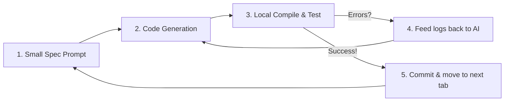

# Vibe Coding Workflow & Setup Guide (Laravel)

This guide is designed to help you execute the HumaNode HRMS project successfully using **vibe coding** (interactive AI pair-programming) with a **Laravel API backend**. It outlines environment setups, prompting strategies, and development loops.

---

## 🛠️ 1. Local Environment Setup

Before starting your vibe-coding sessions, ensure you have the core tools installed on your Mac:

### Backend Development Tools
1.  **PHP 8.2+ & Composer:** Run these to check installations:
    `php -v && composer -v`
2.  **Database (PostgreSQL or MySQL):** 
    *   *Quickest for Vibe Coding:* Run a local database engine (e.g. Postgres App or DBngin) on your Mac.
    *   *Laravel Alternative:* You can prototype with **SQLite** by changing `DB_CONNECTION=sqlite` in Laravel's `.env` configuration file, which creates a local `.sqlite` database file without requiring external servers.

### Frontend Development Tools
1.  **Node.js:** Verify with:
    `node -v && npm -v`
2.  **Flutter:** Verify mobile setup:
    `flutter doctor`

---

## 🚀 2. Vibe-Coding Prompting Framework

When vibe coding, AI models perform best when they write code **incrementally** rather than building whole systems at once. Follow the **Red-Green-Refactor Prompt Loop**:



---

## 📅 3. Phase-by-Phase Vibe Coding Prompts

Use these prompts in your AI coding assistant sessions to construct the systems step-by-step:

### Session 1: Scaffolding the Laravel API Backend
*   **Prompt to AI:**
    > "I am building the HumaNode HRMS project. Let's start by scaffolding the Laravel API backend in a `/backend` directory.
    > 1. Scaffold a clean Laravel 11 project.
    > 2. Set up the environment `.env` to connect to a local PostgreSQL database (or SQLite).
    > 3. Read [database_schema.md](file:///Users/abhishekanair/MyGithubProfile/HRMS/architecture/database_schema.md) and create the migration files for `users`, `departments`, `designations`, and `employees`.
    > 4. Create the corresponding Eloquent models with their relationships."

### Session 2: Authentication & Sanctum API Tokens
*   **Prompt to AI:**
    > "Now let's implement the auth API in Laravel.
    > 1. Set up Laravel Sanctum for API token authorization.
    > 2. Create `AuthController` with `login`, `register` (HR only access), and `logout` endpoints.
    > 3. Return the user details along with the Sanctum PlainTextToken upon successful login.
    > 4. Create a seeder (`DatabaseSeeder.php`) with 1 Admin, 1 HR, 2 Managers, and 5 Employees for testing."

### Session 3: Laravel Blade UI Frontend Setup
*   **Prompt to AI:**
    > "Configure the Laravel Blade views inside `backend/resources/views` using the design systems in [frontend_architecture.md](file:///Users/abhishekanair/MyGithubProfile/HRMS/architecture/frontend_architecture.md). Set up Tailwind CSS, Vite compilation config, and Alpine.js. Create the custom layout views, header, and sidebar components with Spatie roles protection."

### Session 4: Geofenced Mobile Attendance (Flutter)
*   **Prompt to AI:**
    > "Read [flutter_app_guide.md](file:///Users/abhishekanair/MyGithubProfile/HRMS/architecture/flutter_app_guide.md). We need to connect our Flutter mobile app to the Laravel API.
    > 1. Create a Dio client that automatically attaches the stored Bearer token to requests.
    > 2. Write the geofenced clock-in logic. When the user checks in, verify if they are within 100 meters of the office (Office Lat: 25.2048, Lng: 55.2708).
    > 3. Submit a POST request to `/api/attendance/clock-in` containing the latitude, longitude, and is_field_checkin flag.
    > 4. Build a clean, glowing dashboard layout around this button."

---

## 🧹 4. Running & Validating the Projects

Ensure all components can build and compile cleanly by running these checkups:

### Running the Backend
```bash
cd backend
php artisan serve   # Runs Laravel on http://10.0.2.2:8000 or http://localhost:8000
```
*Note: Make sure CORS is configured in `config/cors.php` or `bootstrap/app.php` in Laravel 11 to allow requests from your React Web port (e.g. `http://localhost:5173`).*

### Running the Vite Asset Bundler
```bash
cd backend
npm run dev         # Runs Vite asset compiler with Hot Module Replacement (HMR) for Blade
```

### Running the Mobile Client
```bash
cd mobile_app
flutter run         # Compiles and deploys to iOS simulator or Android emulator
```
